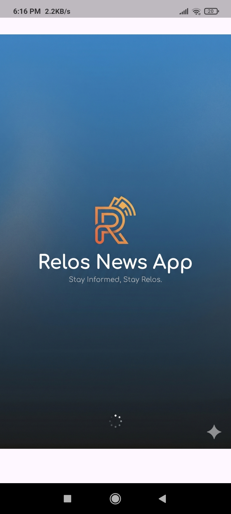
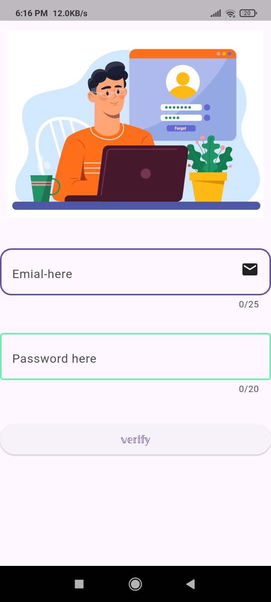
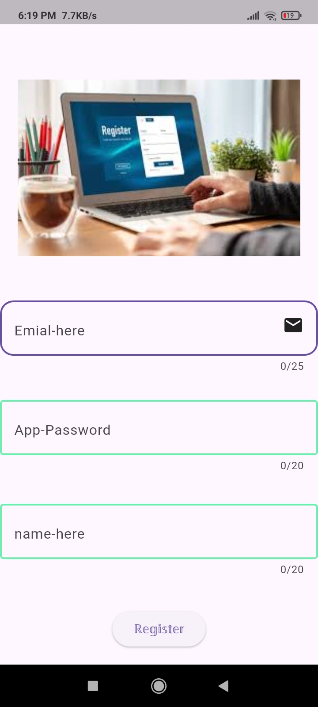
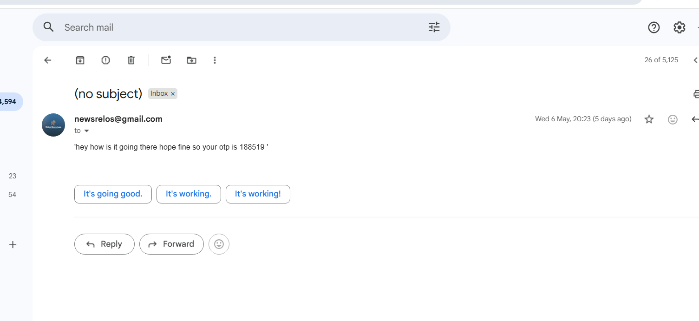
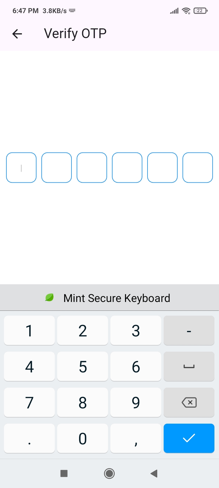

# 📰 Relos News App  

> ⚡ AI-powered Flutter news application with swipe-based navigation, Hinglish AI summarization, OTP authentication, and FastAPI backend integration.  
> 📸 Screenshots & demo video are available at the end of this README.

---

# 🚀 Features

- 🔥 Swipe-based news navigation (Left ↔ Right)
- 🤖 AI-powered Hinglish news summarization using Gemini
- 📰 Real-time news fetching using NewsAPI.org
- 🔐 Login & Register system with FastAPI backend
- 📧 Email OTP verification with Redis expiry support
- ⚡ Async FastAPI backend with PostgreSQL
- 🌐 In-app browser for full article reading
- 📄 Pagination implemented (50 news/articles per page)
- 🧠 MVVM architecture implementation
- 🎯 Floating Action Button (FAB) for instant AI summary access
- ☁️ Backend & PostgreSQL deployed on Render
- 🔖 Bookmark feature currently under development

---

# 🛠 Tech Stack

- **Frontend:** Flutter  
- **Architecture:** MVVM  
- **State Management:** Riverpod + GetX (Screen Navigation)  
- **Backend:** FastAPI  
- **Database:** PostgreSQL  
- **Caching / OTP Expiry:** Redis  
- **Authentication:** JWT + Email OTP Verification  
- **AI Summarization:** Gemini API  
- **News Provider:** NewsAPI.org  
- **Backend Deployment:** Render  
- **Database Hosting:** Render PostgreSQL  
- **Programming Style:** Asynchronous Programming  
- **Pagination:** Page Size = 50  

---

# 📱 App Workflow

1. User registers using email & password  
2. OTP is sent to email via backend  
3. Redis handles OTP expiration (60 seconds)  
4. After verification, user can access news feed  
5. Users can:
   - Swipe right → next news
   - Swipe left → previous news
   - Open full article inside in-app browser
   - Tap AI button for Hinglish summary

---

# ✨ AI Summarization Feature

The app includes an AI-powered summarizer using Gemini API.

Users can:
- Generate simplified Hinglish summaries
- Understand lengthy articles quickly
- Read engaging summaries directly inside the app

---

# 🧱 Backend Highlights

- FastAPI asynchronous APIs
- PostgreSQL integration
- Redis-based OTP expiry system
- JWT Authentication
- Async database operations
- Secure login/register flow
- Modular backend structure

---

# 📂 Project Structure

```bash
lib/
 ┣ models/
 ┣ views/
 ┣ viewmodels/
 ┣ services/
 ┣ widgets/
 ┗ main.dart
```

---

# 📸 App Screenshots

## 🚀 Splash Screen



---

## 📰 Main News Swipe Screen


---

## 🤖 AI Hinglish Summarization


---

## 🌐 In-App Browser View


---

## 🔐 Login Screen



---

## 📝 Register Screen



---

## 📧 OTP Email Verification



---

## 🔢 OTP Verification Screen



---

# 🎥 App Demo Video

[▶ Watch App Demo](screenshots/Newsapp_video.mp4)

---

# 🔮 Upcoming Features

- 🔖 Bookmark System
- 🌙 Dark Mode
- 🧠 Personalized News Feed
- 📌 Category-based filtering

---

# 👨‍💻 Developer

**Mayank Mishra**

---

# ⭐ If you like this project

Give this repository a ⭐ on GitHub.
